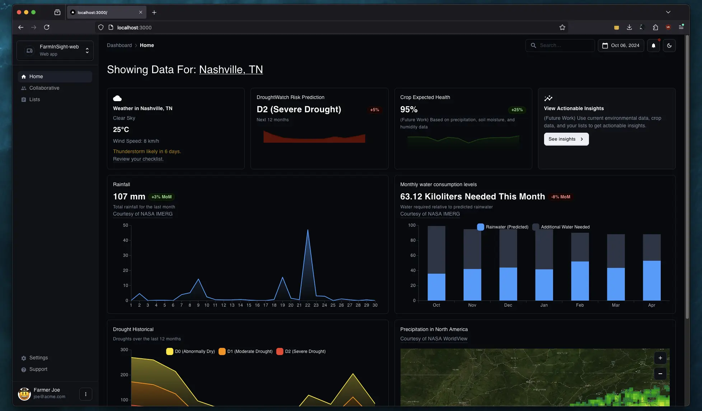

# FarmInSight

FarmInSight is a web application developed as part of the NASA SpaceApps Challenge. It empowers farmers by providing actionable insights to optimize their workflows, leveraging data-driven predictions for drought and precipitation levels.

[farminsight.vercel.app](https://farminsight.vercel.app/)

## Table of Contents

- [Project Info](#project-info)
  - [Challenge Statement](#challenge-statement)
  - [Some Objectives](#some-objectives)
  - [Our Solution: FarmInSight](#our-solution-farminsight)
- [Data Sources](#data-sources)
- [Setup](#setup)
  - [Next.js Web Application](#nextjs-web-application)
  - [Python Machine Learning Scripts](#python-machine-learning-scripts)
- [Future Work](#future-work)
- [Acknowledgements](#acknowledgements)

## Project Info

### Challenge Statement

#### Leveraging Earth Observation Data for Informed Agricultural Decision-Making

Farmers face a deluge of water-related challenges due to unpredictable weather, pests, and diseases. These factors can significantly impact crop health, farmers’ profits, and food security. Depending upon the geography, many farmers may face droughts or floods—sometimes both of these extreme events occur within the same season! Your challenge is to design a tool that empowers farmers to easily explore, analyze, and utilize NASA datasets to address these water-related concerns and improve their farming practices.

### Some Objectives

- **Predictive Analytics**: Utilize machine learning to forecast drought and precipitation levels.
- **User-Friendly Interface**: Develop an intuitive web application that presents actionable insights to farmers.
- **Data Integration**: Aggregate and process diverse datasets to support accurate predictions.
- **Scalability**: Create a prototype that can be expanded into a full-fledged product to support a larger user base.

### Our Solution: FarmInSight

<h3 align="center"></h3>

FarmInSight addresses these challenges by providing a comprehensive platform that integrates predictive analytics with an easy-to-use interface. By forecasting drought and precipitation levels, farmers can proactively adjust their workflows, ensuring better crop management and increased productivity.

The dashboard provides valuable insights into future weather and climate conditions such as rainfall and drought. It alerts farmers of impending natural calamities while recommending measures to optimize crop production according to the availability of rainwater. 

Rainfall and drought predictions are made by analyzing historical data collected from NASA to create future trends. The data collected for these trends is fed into a machine-learning model that calculates and predicts similar climate patterns in the future. The larger the dataset, the better the prediction model. 

If implemented with the future work, the tool will provide valuable climate insights to farmers constantly affected by adverse weather conditions. The dashboard reduces complex datasets into bite-sized information, simplifying future crop production planning for farmers in a particular region.

The team aims to have a reliable model that can help farmers plan their farming needs by understanding the current climate conditions from a statistical perspective. 

In terms of tools, coding languages, and software, the team used Next.JS with JavaScript for the Frontend, Python for Data Analysis and Machine Learning, and Material UI for the design guidelines.

## Data Sources

FarmInSight utilizes various datasets to power its predictive models and user interface. Proper citation of these data sources is crucial.

- **NASA Resources from the Challenge Website**
  - *Description*: Provides a list of data sources related to this challenge.
  - *URL*: [https://www.spaceappschallenge.org/](https://www.spaceappschallenge.org/nasa-space-apps-2024/challenges/leveraging-earth-observation-data-for-informed-agricultural-decision-making/?tab=resources)

- **Global Precipitation Measurement (GPM)**
  - *Description*: Offers global precipitation data collected by the GPM satellite.
  - *URL*: [https://gpm.nasa.gov/](https://gpm.nasa.gov/)

- **US Drought Monitor**
  - *Description*: Supplies historical drought data for the US.
  - *URL*: [https://droughtmonitor.unl.edu/](https://droughtmonitor.unl.edu/CurrentMap.aspx)

- **NASA WorldView**
  - *Description*: Supplies extensive climate and weather-related data visualized through map layers.
  - *URL*: [https://worldview.earthdata.nasa.gov/](https://worldview.earthdata.nasa.gov)

- **National Weather Service (US)**
  - *Description*: Provide weather, water and climate data, forecasts, warnings, and impact-based decision support services for the protection of life and property and enhancement of the national economy.
  - *URL*: [https://www.weather.gov/wrh/climate](https://www.weather.gov/wrh/climate?wfo=ohx)
 
- **MeteoMatics Weather API**
  - *Description*: Meteomatics specializes in high-resolution commercial weather forecasting, power output forecasting for wind, solar and hydro, weather data gathering from the lower atmosphere using Meteodrones, and weather data delivery via the Weather API.
  - *URL*: [https://www.meteomatics.com/](https://www.meteomatics.com/)

- **NASA EarthData GES DISC IMERG**
  - *Description*: The GES DISC specializes in archiving, distributing, stewarding, and providing user data access and analysis services for remote sensing data associated with global Atmospheric Composition, Atmospheric Dynamics, Hydrology, Precipitation, and Global Modeling data.
  - *URL*: [https://disc.gsfc.nasa.gov/](https://disc.gsfc.nasa.gov/datasets/GPM_3IMERGDE_06/summary?keywords=%22IMERG%20Early%22)

## Future Work

FarmInSight is an MVP with several avenues for future enhancement:

- **Collaborative Farming Workflows**
  - Coordinate farmers by defined geopolitical regions to further support the agriculture economy through smart directions (e.g., which crops to grow based on other farmers around you) and transparent communication (e.g., insights into other farms).

- **Enhanced Predictive Models**
  - Incorporate more advanced machine learning algorithms to improve prediction accuracy.
  
- **Real-Time Data Integration**
  - Integrate real-time data streams for up-to-the-minute insights.
  
- **User Authentication and Personalization**
  - Implement user accounts to personalize insights based on individual farm data.
      
- **Expanded Data Sources**
  - Incorporate additional datasets, such as soil quality and crop health metrics.

## Setup

The project is divided into two main parts: the Next.js web application and the Python machine learning scripts. Each part has its own setup process.

### Next.js Web Application

1. **Clone the Repository**

   ```bash
   git clone https://github.com/ahmd-sh/FarmInSight.git
   cd FarmInSight
   ```

2. **Install Dependencies**

   Ensure you have [Node.js](https://nodejs.org/) installed. Then run:

   ```bash
   npm install
   ```

3. **Run the Development Server**

   ```bash
   npm run dev
   ```

   The application will be available at [http://localhost:3000](http://localhost:3000).

4. **Build for Production**

   ```bash
   npm run build
   npm start
   ```

### Python Machine Learning Scripts

1. **Navigate to the ML Scripts Directory**

   ```bash
   cd data/ml-scripts
   ```

2. **Create a Virtual Environment (Optional but Recommended)**

   ```bash
   python3 -m venv env
   source env/bin/activate
   ```

3. **Install Dependencies**

   Ensure you have [Python 3.8+](https://www.python.org/) installed. Then run:

   ```bash
   pip install -r requirements.txt
   ```

4. **Run the Prediction Scripts**

   - **Drought Level Prediction**

     ```bash
     python predict_drought.py
     ```

   - **Precipitation Level Prediction**

     ```bash
     python predict_precipitation.py
     ```

## Acknowledgements

FarmInSight was developed using the following tools and resources:

- **Next.js**: A React framework for building server-side rendered applications.
- **Material-UI (MUI)**: A popular React UI framework for designing responsive interfaces.
- **Python**: Utilized for developing machine learning scripts.
- **NASA**: For providing invaluable datasets through the NASA SpaceApps Challenge.
- **MeteoMatics**: For providing efficient weather APIs with excellent developer experience.
- **Open-Source Libraries**: Thanks to the open-source community for the myriad of libraries that made this project possible.

We extend our gratitude to [NASA](https://github.com/NASA) for the opportunity to participate in the SpaceApps Challenge and for the access to high-quality datasets that form the backbone of FarmInSight.

---

*For any inquiries or contributions, please contact [ahmeds@mun.ca] or open an issue on the [GitHub repository](https://github.com/yourusername/FarmInSight).*
